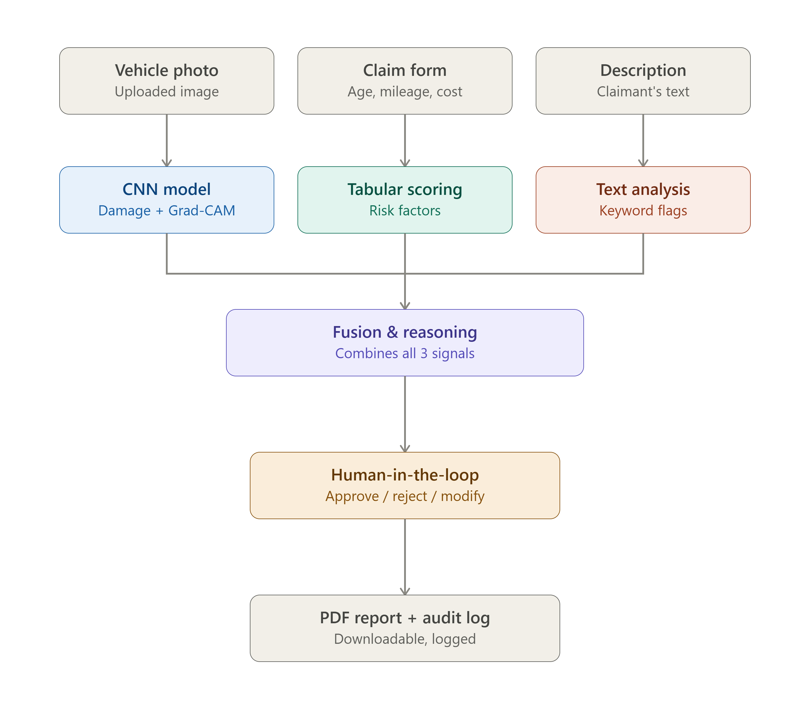

# ClaimAI — AI Co-Pilot for Insurance Claim Processing

An AI co-pilot that helps insurance adjusters triage car damage claims faster,
using image, tabular, and text data together, with explainable predictions and
a human-in-the-loop approval step.

## Live Demo

Run locally: `streamlit run app.py` (see Setup below)

## Architecture



Three input modalities (photo, claim form, description) flow into matching
processing modules (CNN + Grad-CAM, tabular scoring, text keyword analysis),
which combine into a fusion/reasoning step, then human review, then a PDF
report and audit log.

## What it does

- **Deep learning**: A CNN trained from scratch classifies vehicle photos as
  damaged or whole (~81% validation accuracy).
- **Explainable AI**: Confidence score + Grad-CAM heatmap showing which part
  of the photo drove the decision.
- **Multimodal**: Combines the photo with claim form data (vehicle age,
  mileage, repair cost) and the claimant's written description.
- **Human-in-the-loop**: Every AI recommendation is reviewed by a human
  adjuster (Approve / Reject / Modify) before being logged.
- **Reporting**: Generates a downloadable PDF summary per claim and keeps an
  audit log (claims_log.csv) of every decision.

## Setup

```bash
pip install -r requirements.txt
# copy your trained best_model.pth into this folder
streamlit run app.py
```

## Business Model & Commercialization

**Problem:** Manual car-insurance claim triage is slow and inconsistent —
adjusters review photos, paperwork, and claim descriptions separately.

**Solution:** ClaimAI pre-screens every claim across photo, policy data, and
claim narrative in seconds, gives a transparent (Grad-CAM-backed) reason for
its assessment, and routes low-risk claims toward fast-track approval while
flagging high-risk ones for closer manual review.

**Revenue model:**
- SaaS subscription for insurers (per-adjuster or per-claim pricing)
- Enterprise API licensing for integration into existing claims systems
- Tiered plans: Starter, Professional (audit log + reporting), Enterprise
  (custom fine-tuning, SLA support)

**Why it's viable:**
- Reduces adjuster time-per-claim → lower operating cost
- Explainability supports regulatory compliance, reduces disputes
- Human-in-the-loop keeps a human accountable — avoids the liability issues
  of fully automated claim decisions
- Extensible to other claim types (property, health) as a future product line

**Target customers:** Mid-size auto insurers and third-party claims
administrators currently relying on fully manual photo review.

## Project files

- `app.py` — Streamlit web application (main deliverable)
- `requirements.txt` — Python dependencies
- `claimai_architecture.jpg` — system architecture diagram
- `notebooksClaimAI.ipynb.ipynb` — model training notebook (CNN, Grad-CAM, full pipeline)
- `sample_reportsCLM-20260712024829_report.pdf.pdf` — sample AI-generated claim report
